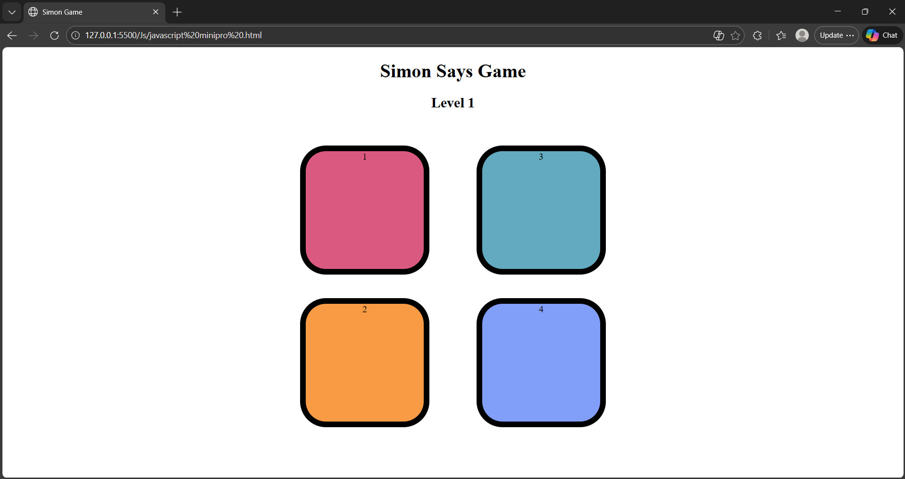

# Simon Game 🎮

A simple and interactive **Simon Game** built using **HTML, CSS, and JavaScript**.

The game tests your memory by challenging you to remember and repeat an increasingly long sequence of colors.

## 🚀 Features

- 🎨 Interactive color buttons
- 🧠 Memory-based gameplay
- 📈 Increasing difficulty with each level
- 🎯 Tracks the current level
- 🔊 Interactive button effects
- 📱 Simple and responsive design

## 🛠️ Technologies Used

- **HTML** – Structure of the game
- **CSS** – Styling and animations
- **JavaScript** – Game logic and user interaction

## 🎮 How to Play

1. Press any key to start the game.
2. The game will highlight a color button.
3. Remember the sequence shown by the game.
4. Click the buttons in the same order.
5. Each successful round adds another color to the sequence.
6. If you click the wrong button, the game ends.

## 📂 Project Structure

```text
simon_game/
│
├── javascript minipro.html
├── javascript minipro.css
├── javascript minipro.js
├── README.md
└── images/
    └── simon_game.png
```

## 🌐 Live Demo

You can add your deployed project link here:

**[Play Simon Game](YOUR_LIVE_DEMO_LINK)**

## 📸 Screenshot

Screenshot of the game:



## 👨‍💻 Author

**Shriyash Gaikwad**

---

⭐ If you like this project, consider giving it a star!
